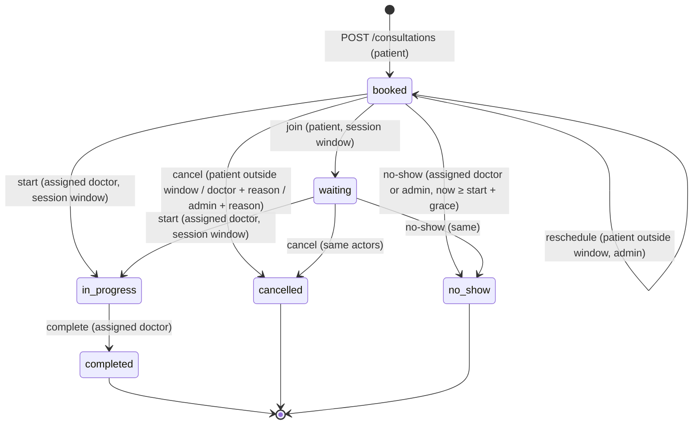
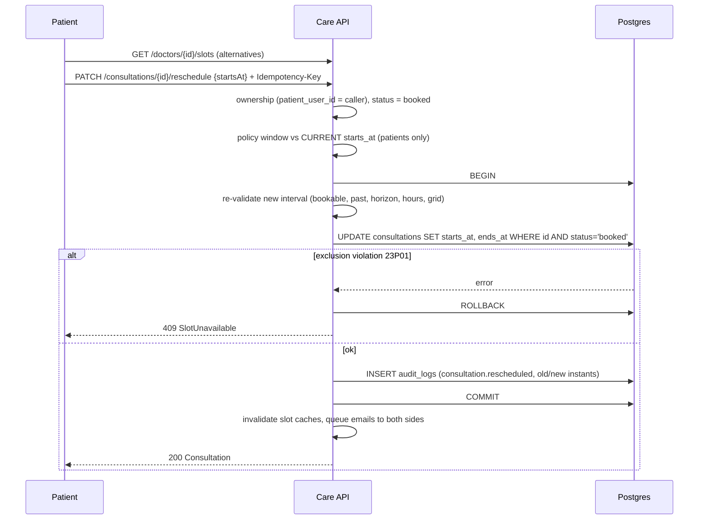
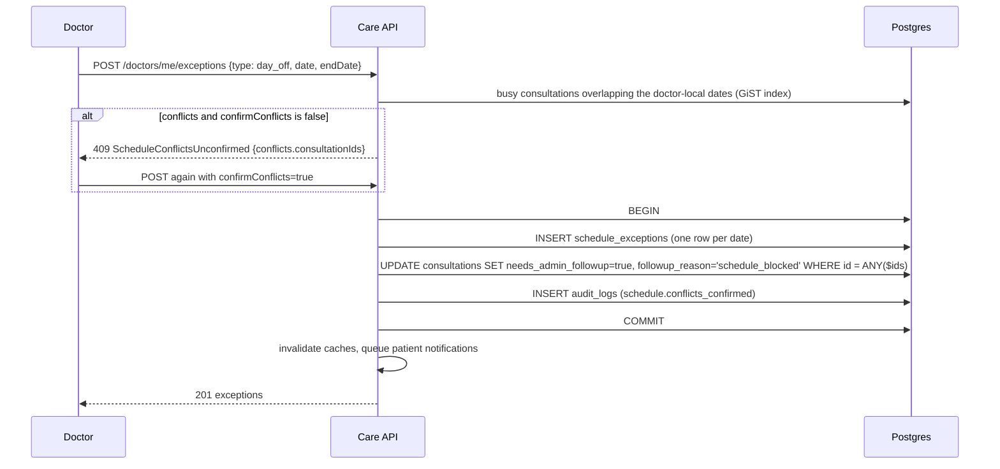

# Consultation Lifecycle

`booked → waiting → in_progress → completed`, with `cancelled` and `no_show` as terminal exits
(CLAUDE.md → Domain rules, Lifecycle).

## State diagram

## Transition table
| Transition | Route | Actor | Condition | Error on violation |
|---|---|---|---|---|
| create → `booked` | `POST /consultations` | patient (active, email verified) | Domain rules 1–8 | see [scheduling-slots.md](./scheduling-slots.md) |
| `booked → waiting` | `PATCH /:id/join` | patient | inside session window | 409 `RoomNotOpen` |
| `booked/waiting → in_progress` | `PATCH /:id/start` | assigned doctor | inside session window, doctor not suspended | 409 `RoomNotOpen`, 403 `Forbidden` |
| `in_progress → completed` | `PATCH /:id/complete` | assigned doctor | — | 409 `InvalidTransition` |
| `booked/waiting → cancelled` | `PATCH /:id/cancel` | patient (outside policy window), assigned doctor (reason), admin (reason, any time) | not terminal | 409 `PolicyWindowViolation` / `InvalidTransition`, 400 missing reason |
| `booked/waiting → no_show` | `PATCH /:id/no-show` | assigned doctor or admin | now ≥ `starts_at` + grace | 409 `NoShowTooEarly` |
| reschedule (status stays `booked`) | `PATCH /:id/reschedule` | patient (outside policy window), admin (reason) | new slot passes rules 1–5; old interval released in the same transaction | 409 / 422 booking codes |

- **Terminal states never change** (Domain rule 9): every update is `… WHERE id=$1 AND status = ANY($from)`;
  zero rows → `409 InvalidTransition`.
- A doctor re-joining (`/join` on `waiting` or `in_progress`) receives a fresh video token with no transition.
- Every status change writes an audit row (`consultation.<to_status>`) in the same transaction and invalidates the
  doctor's slot and next-available caches after commit (terminal exits free the interval).
- Suspended doctors (`suspended_at IS NOT NULL`) cannot start, complete, cancel, or mark no-show — checked
  locally, not only at token expiry.

## Time windows
| Window | Default | Env | Rule |
|---|---|---|---|
| Policy window | 120 min before `starts_at` | `CANCELLATION_POLICY_MINUTES=120` | patients cannot cancel or reschedule inside it (measured against the **current** start); admins can |
| No-show grace | 10 min after `starts_at` | `NO_SHOW_GRACE_MINUTES=10` | `no_show` only when now ≥ start + grace |
| Session window | `[starts_at − 10 min, ends_at + 15 min]` | `WAITING_ROOM_OPEN_MINUTES=10`, `SESSION_OVERRUN_MINUTES=15` | join/start only inside it; video tokens issued only inside it |

All comparisons are on UTC instants.

## Session (waiting room and video)
1. The patient calls `/join` inside the window: `booked → waiting`, `joined_at` set, the room is created lazily at
   the provider if `room_id` is null, and a short-lived join token bound to this participant is returned.
2. The doctor polls `GET /consultations/waiting-room` (their consultations whose window is open).
3. The doctor calls `/start`: `→ in_progress`, `started_at` set, doctor join token returned, "your doctor has joined"
   email queued asynchronously.
4. The doctor calls `/complete`: `→ completed`. The record can now be written ([clinical-records.md](./clinical-records.md)).

## Flow D — Reschedule

The same row is updated, so the old interval is released atomically when the new one is claimed. Admins follow
the same path without the policy window and with a required `reason` (audited as admin-action).

## Flow E — Cancellation
Patient outside the window, doctor with a reason, or admin at any time with a reason:
`BEGIN → UPDATE status='cancelled', cancelled_at, cancelled_by, cancelled_by_user_id, cancel_reason
WHERE status IN ('booked','waiting') → audit → COMMIT → invalidate caches → notify both parties (async)`.
The exclusion constraint's predicate no longer covers the row, so the slot is immediately bookable again.
Cancellation is idempotent on `Idempotency-Key`; a second cancel with a new key returns `409 InvalidTransition`.

## Flow F — Doctor takes leave

Consultations are **never auto-cancelled**. Admins work the follow-up queue
(`GET /consultations?needsAdminFollowup=true`) and reschedule or cancel on behalf. Working-hours replacement follows
the same conflict protocol.

## Flow G — Suspension (summary)
Case 3 flags every future non-terminal consultation `needs_admin_followup=true`
(`followup_reason='doctor_suspended'`) and blocks all doctor actions and new bookings from commit time. See
[integration.md](./integration.md).
