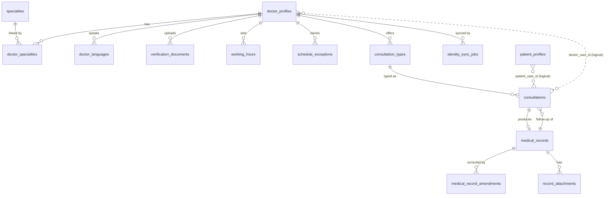

# Data Model — care-service

PostgreSQL 17, one database owned by Care. **Built so far:** foundation (2026-09-28) —
`20260915000000_create_extension_btree_gist` (the extension only); access (2026-10-02) — `create_app_role` (the
`NOLOGIN` group role `vcare_app`), `create_audit_logs`, `create_audit_logs_ensure_partitions` (see `audit_logs`
below); specialties (2026-10-04) — `20261004120000_create_specialties`, `20261004120100_seed_specialties_starter_catalog`
(see `specialties` below); doctors (2026-10-05) — `20261005120000_create_doctor_profiles`,
`20261005120100_create_doctor_languages`, `20261005120200_create_doctor_specialties`. `knex_migrations` records migration names without the file extension. Everything else below is the design the
remaining modules will build. Written in the style migrations
will use (`knex.raw`, see the `write-migration` skill). Conventions:

- `id BIGSERIAL` everywhere; FKs `BIGINT` with named constraints and a leading-column index.
- Identity references are `*_user_id BIGINT` with **no FK** (`-- Identity user id`).
- All instants `TIMESTAMPTZ` (UTC sessions). Wall-clock schedule times are `TIME` interpreted in `doctor_profiles.timezone`.
- Enum-like columns are `VARCHAR … CHECK (… IN (…))`, never native `ENUM`; no defaults on critical columns.
- Soft delete (`deleted_at`) for profiles, records, attachments, help articles, consultation types, exceptions,
  working hours. Uniqueness among live rows uses partial unique indexes.
- `ON DELETE RESTRICT` everywhere; clinical tables never cascade.
- Every index names the query it serves. There is **no slots or availability table** ([ADR 0002](../adr/0002-slots-never-stored.md)).
- **Roles and grants** ([ADR 0018](../adr/0018-db-role-split-explicit-grants-partition-function.md)): the owner `care`
  owns everything and runs migrations; the app login `care_app` (member of `vcare_app`) is what `care-api` and
  `care-worker` use. Every table migration grants `vcare_app` explicitly (no `ALTER DEFAULT PRIVILEGES`); append-only
  tables get `INSERT, SELECT` only (+ `USAGE` on their sequence), the `INSERT` column-level so the app can never set
  `id` or `created_at`.

## ERD



Dotted lines are logical joins on Identity user ids (`doctor_profiles.user_id = consultations.doctor_user_id`),
not FKs: `consultations` keys doctors by user id so the exclusion constraint and every cross-service call use the
same stable person id.

---

## `specialties`
**Built by `specialties` (2026-10-04)** — migration `20261004120000_create_specialties`; the 20-row synthetic starter
catalog is the separate data migration `20261004120100_seed_specialties_starter_catalog` (`ON CONFLICT DO NOTHING`;
its `down` removes only unreferenced starter slugs). Detail: [specialties spec](../specialties/spec.md) §2.
```sql
CREATE TABLE specialties (
    id           BIGSERIAL PRIMARY KEY,
    name         VARCHAR(100) NOT NULL,
    slug         VARCHAR(100) NOT NULL,
    description  TEXT,
    is_active    BOOLEAN NOT NULL,                     -- no default: the INSERT states it
    created_at   TIMESTAMPTZ NOT NULL DEFAULT NOW(),
    updated_at   TIMESTAMPTZ NOT NULL DEFAULT NOW(),   -- set by the UPDATE statement, no trigger
    CONSTRAINT uq_specialties_slug UNIQUE (slug),
    CONSTRAINT uq_specialties_name UNIQUE (name),      -- case-sensitive (database default collation)
    CONSTRAINT chk_specialties_slug_format CHECK (slug ~ '^[a-z0-9]+(-[a-z0-9]+)*$'),
    CONSTRAINT chk_specialties_name_length CHECK (char_length(name) >= 2),
    CONSTRAINT chk_specialties_description_length CHECK (description IS NULL OR char_length(description) <= 2000)
);
-- No soft delete: specialties are deactivated (is_active=false), never removed, because doctor links reference them.
-- GET /api/specialties keyset page:
--   SELECT … FROM specialties [WHERE is_active = true] [AND (name, id) > ($name, $id)] ORDER BY name ASC, id ASC LIMIT $n
CREATE INDEX idx_specialties_name_id ON specialties (name, id);
-- uq_specialties_slug also serves: search filter ?specialty=<slug> → SELECT id FROM specialties WHERE slug = $1
GRANT SELECT, INSERT, UPDATE ON specialties TO vcare_app;   -- no DELETE, no TRUNCATE (never deleted)
GRANT USAGE ON SEQUENCE specialties_id_seq TO vcare_app;
```
The two length checks and `VARCHAR(100)` count characters (code points); the API DTOs count the same unit and reject
control characters in `name` and NUL in `description`, so valid input never reaches a database error.

## `doctor_profiles`
```sql
CREATE TABLE doctor_profiles (
    id                     BIGSERIAL PRIMARY KEY,
    user_id                BIGINT NOT NULL,              -- Identity user id
    headline               VARCHAR(160) NOT NULL,
    bio                    TEXT,
    years_experience       INT NOT NULL,
    consultation_fee       INT NOT NULL,                 -- minor units, no default
    currency               CHAR(3) NOT NULL,
    default_slot_minutes   INT NOT NULL,
    timezone               VARCHAR(64) NOT NULL,         -- IANA, validated with luxon
    is_accepting_patients  BOOLEAN NOT NULL,
    verification_status    VARCHAR(16) NOT NULL,
    submitted_at           TIMESTAMPTZ,
    reviewed_by            BIGINT,                       -- Identity user id (admin)
    review_note            TEXT,
    decided_at             TIMESTAMPTZ,
    identity_sync_status   VARCHAR(16) NOT NULL,
    suspended_at           TIMESTAMPTZ,
    suspended_by           BIGINT,                       -- Identity user id (admin)
    suspension_reason      TEXT,
    created_at             TIMESTAMPTZ NOT NULL DEFAULT NOW(),
    updated_at             TIMESTAMPTZ NOT NULL DEFAULT NOW(),
    deleted_at             TIMESTAMPTZ,
    CONSTRAINT chk_doctor_profiles_verification_status
        CHECK (verification_status IN ('draft', 'submitted', 'approved', 'rejected')),
    CONSTRAINT chk_doctor_profiles_identity_sync_status
        CHECK (identity_sync_status IN ('not_required', 'pending', 'synced', 'failed')),
    CONSTRAINT chk_doctor_profiles_years_experience CHECK (years_experience BETWEEN 0 AND 70),
    CONSTRAINT chk_doctor_profiles_fee CHECK (consultation_fee >= 0),
    CONSTRAINT chk_doctor_profiles_currency CHECK (currency ~ '^[A-Z]{3}$'),
    CONSTRAINT chk_doctor_profiles_default_slot CHECK (default_slot_minutes BETWEEN 5 AND 240),
    CONSTRAINT chk_doctor_profiles_headline_length CHECK (char_length(headline) >= 5),
    CONSTRAINT chk_doctor_profiles_bio_length CHECK (bio IS NULL OR char_length(bio) <= 4000),
    CONSTRAINT chk_doctor_profiles_suspension
        CHECK ((suspended_at IS NULL AND suspension_reason IS NULL)
            OR (suspended_at IS NOT NULL AND suspension_reason IS NOT NULL)),
    CONSTRAINT chk_doctor_profiles_decision
        CHECK (verification_status NOT IN ('approved', 'rejected') OR decided_at IS NOT NULL)
);

-- One live profile per doctor account. Serves every /doctors/me/* policy lookup:
--   SELECT … FROM doctor_profiles WHERE user_id = $auth.userId AND deleted_at IS NULL
-- and GET /doctors/:doctorUserId, /internal/doctors/:userId/summary, PATCH /admin/doctors/:doctorUserId/suspend.
CREATE UNIQUE INDEX uq_doctor_profiles_user_id ON doctor_profiles (user_id) WHERE deleted_at IS NULL;

-- Search candidate set (Domain rule 6) ordered/filtered by fee:
--   WHERE verification_status='approved' AND identity_sync_status='synced' AND suspended_at IS NULL
--     AND is_accepting_patients AND deleted_at IS NULL AND consultation_fee BETWEEN $min AND $max
--   ORDER BY consultation_fee, id  (sort=price keyset)
CREATE INDEX idx_doctor_profiles_bookable_fee_id ON doctor_profiles (consultation_fee, id)
    WHERE verification_status = 'approved' AND identity_sync_status = 'synced'
      AND suspended_at IS NULL AND is_accepting_patients AND deleted_at IS NULL;

-- sort=experience keyset: ORDER BY years_experience DESC, id DESC on the same bookable subset.
CREATE INDEX idx_doctor_profiles_bookable_experience_id ON doctor_profiles (years_experience DESC, id DESC)
    WHERE verification_status = 'approved' AND identity_sync_status = 'synced'
      AND suspended_at IS NULL AND is_accepting_patients AND deleted_at IS NULL;

-- Admin verification queue: GET /admin/applications?status=submitted ORDER BY submitted_at, id
CREATE INDEX idx_doctor_profiles_verification_status_submitted_at_id
    ON doctor_profiles (verification_status, submitted_at, id) WHERE deleted_at IS NULL;
```
**As built:** only `uq_doctor_profiles_user_id` exists among the profile indexes above. The fee, experience,
and verification-queue indexes are deferred until their queries land. The migration comments the Identity user-id
columns and grants `vcare_app` `SELECT, INSERT, UPDATE` but no `DELETE`; the two link-table migrations grant
`DELETE` for set replacement, and the specialties link also grants `UPDATE` to move the primary flag.
The language-code search index below is likewise deferred. Each link table's unique constraint covers its
`doctor_profile_id` FK; the specialties link has its `specialty_id` leading-column index.

The verification **application** is a view over this row plus its documents (application id = profile id,
one per doctor). `identity_sync_status` gates bookability together with `verification_status` (Case 1) and
tracks Case 3 confirmation.

## `doctor_specialties`
```sql
CREATE TABLE doctor_specialties (
    id                 BIGSERIAL PRIMARY KEY,
    doctor_profile_id  BIGINT NOT NULL,
    specialty_id       BIGINT NOT NULL,
    is_primary         BOOLEAN NOT NULL,
    created_at         TIMESTAMPTZ NOT NULL DEFAULT NOW(),
    CONSTRAINT fk_doctor_specialties_doctor_profile_id FOREIGN KEY (doctor_profile_id) REFERENCES doctor_profiles(id) ON DELETE RESTRICT,
    CONSTRAINT fk_doctor_specialties_specialty_id FOREIGN KEY (specialty_id) REFERENCES specialties(id) ON DELETE RESTRICT,
    CONSTRAINT uq_doctor_specialties_doctor_profile_id_specialty_id UNIQUE (doctor_profile_id, specialty_id)
);
-- The unique constraint covers the doctor_profile_id FK and serves: load specialties for a page of doctors
--   WHERE doctor_profile_id = ANY($1)
-- Search filter ?specialty=: EXISTS (… WHERE specialty_id = $1 AND doctor_profile_id = dp.id); also covers the specialty_id FK.
CREATE INDEX idx_doctor_specialties_specialty_id_doctor_profile_id ON doctor_specialties (specialty_id, doctor_profile_id);
-- At most one primary specialty per doctor.
CREATE UNIQUE INDEX uq_doctor_specialties_primary ON doctor_specialties (doctor_profile_id) WHERE is_primary;
```
Doctors apply a set diff when specialties change: removed links are deleted, new links inserted, and the primary
flag moved. Link rows are not soft-delete entities.

## `doctor_languages`
```sql
CREATE TABLE doctor_languages (
    id                 BIGSERIAL PRIMARY KEY,
    doctor_profile_id  BIGINT NOT NULL,
    language_code      CHAR(2) NOT NULL,              -- ISO 639-1
    created_at         TIMESTAMPTZ NOT NULL DEFAULT NOW(),
    CONSTRAINT fk_doctor_languages_doctor_profile_id FOREIGN KEY (doctor_profile_id) REFERENCES doctor_profiles(id) ON DELETE RESTRICT,
    CONSTRAINT uq_doctor_languages_doctor_profile_id_language_code UNIQUE (doctor_profile_id, language_code),
    CONSTRAINT chk_doctor_languages_code CHECK (language_code ~ '^[a-z]{2}$')
);
-- Search filter ?language=ar: EXISTS (SELECT 1 FROM doctor_languages WHERE language_code = $1 AND doctor_profile_id = dp.id)
CREATE INDEX idx_doctor_languages_language_code_doctor_profile_id ON doctor_languages (language_code, doctor_profile_id);
```
**Decision — join table, not a `TEXT[]` column.** Both work for "doctors who speak X". The join table was chosen
because (1) it follows the same btree `EXISTS` pattern as specialties, so the search query combines filters
uniformly and the planner uses composite btree indexes rather than a GIN index whose selectivity estimates are
poorer; (2) each value gets a real `CHECK` and uniqueness per doctor; (3) it leaves room for per-language
attributes (proficiency) without a migration of an array column. Cost: one extra table and a batched load per
page (`WHERE doctor_profile_id = ANY($1)`, served by the unique constraint).

## `verification_documents`
```sql
CREATE TABLE verification_documents (
    id                 BIGSERIAL PRIMARY KEY,
    doctor_profile_id  BIGINT NOT NULL,
    type               VARCHAR(16) NOT NULL,
    object_key         VARCHAR(512) NOT NULL,          -- storage key, never a URL; never logged
    file_type          VARCHAR(32) NOT NULL,
    size_bytes         INT NOT NULL,
    status             VARCHAR(16) NOT NULL,
    reviewed_by        BIGINT,                         -- Identity user id (admin)
    review_note        TEXT,
    created_at         TIMESTAMPTZ NOT NULL DEFAULT NOW(),
    updated_at         TIMESTAMPTZ NOT NULL DEFAULT NOW(),
    deleted_at         TIMESTAMPTZ,
    CONSTRAINT fk_verification_documents_doctor_profile_id FOREIGN KEY (doctor_profile_id) REFERENCES doctor_profiles(id) ON DELETE RESTRICT,
    CONSTRAINT uq_verification_documents_object_key UNIQUE (object_key),
    CONSTRAINT chk_verification_documents_type CHECK (type IN ('license', 'id', 'degree')),
    CONSTRAINT chk_verification_documents_file_type CHECK (file_type IN ('application/pdf', 'image/jpeg', 'image/png')),
    CONSTRAINT chk_verification_documents_size CHECK (size_bytes BETWEEN 1 AND 10485760),
    CONSTRAINT chk_verification_documents_status CHECK (status IN ('uploaded', 'accepted', 'rejected'))
);
-- Application view and submit precondition: documents of a profile by type
--   WHERE doctor_profile_id = $1 AND deleted_at IS NULL ORDER BY type, id
CREATE INDEX idx_verification_documents_doctor_profile_id_type ON verification_documents (doctor_profile_id, type) WHERE deleted_at IS NULL;
```

## `working_hours`
```sql
CREATE TABLE working_hours (
    id                 BIGSERIAL PRIMARY KEY,
    doctor_profile_id  BIGINT NOT NULL,
    weekday            SMALLINT NOT NULL,              -- ISO 1 = Monday … 7 = Sunday, doctor-local
    start_time         TIME NOT NULL,
    end_time           TIME NOT NULL,                  -- '24:00' allowed for a shift ending at midnight
    created_at         TIMESTAMPTZ NOT NULL DEFAULT NOW(),
    updated_at         TIMESTAMPTZ NOT NULL DEFAULT NOW(),
    deleted_at         TIMESTAMPTZ,
    CONSTRAINT fk_working_hours_doctor_profile_id FOREIGN KEY (doctor_profile_id) REFERENCES doctor_profiles(id) ON DELETE RESTRICT,
    CONSTRAINT chk_working_hours_weekday CHECK (weekday BETWEEN 1 AND 7),
    CONSTRAINT chk_working_hours_time_order CHECK (end_time > start_time)
);
-- Slot computation query 2 and GET /doctors/me/working-hours:
--   WHERE doctor_profile_id = $1 AND deleted_at IS NULL ORDER BY weekday, start_time
CREATE INDEX idx_working_hours_doctor_profile_id ON working_hours (doctor_profile_id, weekday, start_time) WHERE deleted_at IS NULL;
```
Several rows per weekday model split shifts; overlap between a doctor's intervals on one weekday is rejected by
the service (the set is replaced atomically by `PUT`, which soft-deletes the old rows in the same transaction).

## `schedule_exceptions`
```sql
CREATE TABLE schedule_exceptions (
    id                 BIGSERIAL PRIMARY KEY,
    doctor_profile_id  BIGINT NOT NULL,
    date               DATE NOT NULL,                  -- doctor-local date
    type               VARCHAR(16) NOT NULL,
    start_time         TIME,
    end_time           TIME,
    reason             VARCHAR(500),
    created_at         TIMESTAMPTZ NOT NULL DEFAULT NOW(),
    updated_at         TIMESTAMPTZ NOT NULL DEFAULT NOW(),
    deleted_at         TIMESTAMPTZ,
    CONSTRAINT fk_schedule_exceptions_doctor_profile_id FOREIGN KEY (doctor_profile_id) REFERENCES doctor_profiles(id) ON DELETE RESTRICT,
    CONSTRAINT chk_schedule_exceptions_type CHECK (type IN ('day_off', 'custom_hours')),
    CONSTRAINT chk_schedule_exceptions_shape CHECK (
        (type = 'day_off' AND start_time IS NULL AND end_time IS NULL)
     OR (type = 'custom_hours' AND start_time IS NOT NULL AND end_time IS NOT NULL AND end_time > start_time))
);
-- One live exception per doctor-local date; also the FK index. Serves slot computation query 3:
--   WHERE doctor_profile_id = $1 AND date BETWEEN $fromDate - 1 AND $toDate + 1 AND deleted_at IS NULL
-- and GET /doctors/me/exceptions keyset (date, id).
CREATE UNIQUE INDEX uq_schedule_exceptions_doctor_profile_id_date ON schedule_exceptions (doctor_profile_id, date) WHERE deleted_at IS NULL;
```

## `consultation_types`
```sql
CREATE TABLE consultation_types (
    id                 BIGSERIAL PRIMARY KEY,
    doctor_profile_id  BIGINT NOT NULL,
    name               VARCHAR(100) NOT NULL,
    duration_minutes   INT NOT NULL,
    price              INT NOT NULL,                   -- minor units, no default
    currency           CHAR(3) NOT NULL,
    is_active          BOOLEAN NOT NULL,
    created_at         TIMESTAMPTZ NOT NULL DEFAULT NOW(),
    updated_at         TIMESTAMPTZ NOT NULL DEFAULT NOW(),
    deleted_at         TIMESTAMPTZ,
    CONSTRAINT fk_consultation_types_doctor_profile_id FOREIGN KEY (doctor_profile_id) REFERENCES doctor_profiles(id) ON DELETE RESTRICT,
    CONSTRAINT chk_consultation_types_duration CHECK (duration_minutes BETWEEN 5 AND 240),
    CONSTRAINT chk_consultation_types_price CHECK (price >= 0),
    CONSTRAINT chk_consultation_types_currency CHECK (currency ~ '^[A-Z]{3}$')
);
-- Unique live name per doctor; leading column covers the FK. Serves GET /doctors/me/consultation-types and the
-- per-page load WHERE doctor_profile_id = ANY($1) AND deleted_at IS NULL.
CREATE UNIQUE INDEX uq_consultation_types_doctor_profile_id_name ON consultation_types (doctor_profile_id, name) WHERE deleted_at IS NULL;
-- Domain rule 6 "at least one active type": EXISTS (… WHERE doctor_profile_id = dp.id AND is_active AND deleted_at IS NULL)
CREATE INDEX idx_consultation_types_doctor_profile_id_active ON consultation_types (doctor_profile_id) WHERE is_active AND deleted_at IS NULL;
```

## `consultations`
```sql
CREATE EXTENSION IF NOT EXISTS btree_gist;

CREATE TABLE consultations (
    id                     BIGSERIAL PRIMARY KEY,
    doctor_user_id         BIGINT NOT NULL,            -- Identity user id (doctor)
    patient_user_id        BIGINT NOT NULL,            -- Identity user id (patient)
    consultation_type_id   BIGINT NOT NULL,
    starts_at              TIMESTAMPTZ NOT NULL,
    ends_at                TIMESTAMPTZ NOT NULL,       -- starts_at + type.duration_minutes, computed server-side
    status                 VARCHAR(16) NOT NULL,       -- no default
    complaint_text         TEXT NOT NULL,              -- clinical; never logged, omitted from admin DTOs
    patient_timezone       VARCHAR(64) NOT NULL,
    price                  INT NOT NULL,               -- snapshot of the type price at booking
    currency               CHAR(3) NOT NULL,
    room_id                VARCHAR(128),               -- video provider room, created lazily at first join/start
    joined_at              TIMESTAMPTZ,                -- patient entered the waiting room
    started_at             TIMESTAMPTZ,
    completed_at           TIMESTAMPTZ,
    cancelled_at           TIMESTAMPTZ,
    cancel_reason          TEXT,
    cancelled_by           VARCHAR(16),
    cancelled_by_user_id   BIGINT,                     -- Identity user id
    no_show_marked_at      TIMESTAMPTZ,
    needs_admin_followup   BOOLEAN NOT NULL DEFAULT FALSE,
    followup_reason        VARCHAR(32),
    follow_up_of_record_id BIGINT,
    reminder_24h_sent_at   TIMESTAMPTZ,                -- ADR 0011; reset to NULL by reschedule
    reminder_1h_sent_at    TIMESTAMPTZ,                -- ADR 0011; reset to NULL by reschedule
    idempotency_key        UUID NOT NULL,
    request_hash           CHAR(64) NOT NULL,          -- sha256 of the booking body, for replay-vs-conflict after Redis loss
    created_at             TIMESTAMPTZ NOT NULL DEFAULT NOW(),
    updated_at             TIMESTAMPTZ NOT NULL DEFAULT NOW(),
    deleted_at             TIMESTAMPTZ,
    CONSTRAINT fk_consultations_consultation_type_id FOREIGN KEY (consultation_type_id) REFERENCES consultation_types(id) ON DELETE RESTRICT,
    CONSTRAINT chk_consultations_status
        CHECK (status IN ('booked', 'waiting', 'in_progress', 'completed', 'cancelled', 'no_show')),
    CONSTRAINT chk_consultations_time_order CHECK (ends_at > starts_at),
    CONSTRAINT chk_consultations_price CHECK (price >= 0),
    CONSTRAINT chk_consultations_cancelled_by CHECK (cancelled_by IS NULL OR cancelled_by IN ('patient', 'doctor', 'admin')),
    CONSTRAINT chk_consultations_cancel_shape
        CHECK ((status = 'cancelled') = (cancelled_at IS NOT NULL AND cancelled_by IS NOT NULL)),
    CONSTRAINT chk_consultations_followup_reason
        CHECK (followup_reason IS NULL OR followup_reason IN ('doctor_suspended', 'schedule_blocked')),
    CONSTRAINT uq_consultations_idempotency UNIQUE (patient_user_id, idempotency_key)
);

-- Domain rule 1 — the guarantee (verbatim from CLAUDE.md → Database rules). Half-open ranges allow back-to-back.
ALTER TABLE consultations
  ADD CONSTRAINT excl_consultations_doctor_no_overlap
  EXCLUDE USING gist (doctor_user_id WITH =, tstzrange(starts_at, ends_at, '[)') WITH &&)
  WHERE (status NOT IN ('cancelled', 'no_show') AND deleted_at IS NULL);
-- Its GiST index also serves slot computation query 5, conflict detection for schedule changes, and the calendar:
--   WHERE doctor_user_id = $1 AND tstzrange(starts_at, ends_at, '[)') && tstzrange($from, $to, '[)')
--     AND status IN ('booked','waiting','in_progress') AND deleted_at IS NULL
-- No duplicate btree for that query.

-- uq_consultations_idempotency serves the in-transaction replay check:
--   WHERE patient_user_id = $auth.userId AND idempotency_key = $key

-- Patient list GET /consultations?scope=upcoming|past keyset on (starts_at, id):
--   WHERE patient_user_id = $1 AND deleted_at IS NULL AND starts_at >= now() ORDER BY starts_at, id
CREATE INDEX idx_consultations_patient_user_id_starts_at_id ON consultations (patient_user_id, starts_at, id) WHERE deleted_at IS NULL;

-- Doctor list GET /consultations (doctor) and the terminal-inclusive calendar/list:
--   WHERE doctor_user_id = $1 AND deleted_at IS NULL AND starts_at BETWEEN … ORDER BY starts_at, id
CREATE INDEX idx_consultations_doctor_user_id_starts_at_id ON consultations (doctor_user_id, starts_at, id) WHERE deleted_at IS NULL;

-- Doctor↔patient relationship check for GET /patients/:id, /patients/:id/records, /records/:id:
--   EXISTS (SELECT 1 FROM consultations WHERE doctor_user_id = $auth AND patient_user_id = $1
--           AND status IN ('booked','waiting','in_progress','completed') AND deleted_at IS NULL)
CREATE INDEX idx_consultations_doctor_user_id_patient_user_id ON consultations (doctor_user_id, patient_user_id)
    WHERE deleted_at IS NULL AND status IN ('booked', 'waiting', 'in_progress', 'completed');

-- FK index + "type in use" check on type changes: WHERE consultation_type_id = $1
CREATE INDEX idx_consultations_consultation_type_id ON consultations (consultation_type_id);

-- Admin follow-up queue GET /consultations?needsAdminFollowup=true ORDER BY starts_at, id
CREATE INDEX idx_consultations_followup_starts_at_id ON consultations (starts_at, id)
    WHERE needs_admin_followup AND deleted_at IS NULL AND status IN ('booked', 'waiting');

-- Reminder scan (care-worker, every minute, ADR 0011):
--   WHERE status = 'booked' AND deleted_at IS NULL AND starts_at BETWEEN now() AND now() + interval '24 hours'
--     AND (reminder_24h_sent_at IS NULL OR reminder_1h_sent_at IS NULL) ORDER BY starts_at LIMIT 200
CREATE INDEX idx_consultations_booked_starts_at ON consultations (starts_at) WHERE status = 'booked' AND deleted_at IS NULL;

-- FK index for follow-up bookings: WHERE follow_up_of_record_id = $1
CREATE INDEX idx_consultations_follow_up_of_record_id ON consultations (follow_up_of_record_id) WHERE follow_up_of_record_id IS NOT NULL;
-- fk_consultations_follow_up_of_record_id is added after medical_records exists (circular reference):
ALTER TABLE consultations ADD CONSTRAINT fk_consultations_follow_up_of_record_id
    FOREIGN KEY (follow_up_of_record_id) REFERENCES medical_records(id) ON DELETE RESTRICT;
```
Status updates are guarded: `UPDATE … SET status=$new WHERE id=$1 AND status = ANY($allowedFrom)` — zero rows
updated means `409 InvalidTransition` (Domain rule 9). SQLSTATE `23P01` on insert or reschedule maps to
`409 SlotUnavailable`.

## `patient_profiles`
```sql
CREATE TABLE patient_profiles (
    id                  BIGSERIAL PRIMARY KEY,
    user_id             BIGINT NOT NULL,                -- Identity user id
    date_of_birth       DATE,
    gender              VARCHAR(16),
    blood_type          VARCHAR(8),
    allergies           TEXT[] NOT NULL DEFAULT '{}',   -- clinical; never logged
    chronic_conditions  TEXT[] NOT NULL DEFAULT '{}',   -- clinical; never logged
    timezone            VARCHAR(64) NOT NULL,
    created_at          TIMESTAMPTZ NOT NULL DEFAULT NOW(),
    updated_at          TIMESTAMPTZ NOT NULL DEFAULT NOW(),
    deleted_at          TIMESTAMPTZ,
    CONSTRAINT chk_patient_profiles_gender CHECK (gender IS NULL OR gender IN ('female', 'male', 'other', 'undisclosed')),
    CONSTRAINT chk_patient_profiles_blood_type
        CHECK (blood_type IS NULL OR blood_type IN ('A+','A-','B+','B-','AB+','AB-','O+','O-','unknown')),
    CONSTRAINT chk_patient_profiles_allergies_len CHECK (cardinality(allergies) <= 50),
    CONSTRAINT chk_patient_profiles_conditions_len CHECK (cardinality(chronic_conditions) <= 50)
);
-- GET/PATCH /patients/me and GET /patients/:patientUserId: WHERE user_id = $1 AND deleted_at IS NULL
CREATE UNIQUE INDEX uq_patient_profiles_user_id ON patient_profiles (user_id) WHERE deleted_at IS NULL;
```
Allergies and conditions are free-text lists that are only displayed, never filtered on, so arrays are adequate here.

## `medical_records`
```sql
CREATE TABLE medical_records (
    id                  BIGSERIAL PRIMARY KEY,
    consultation_id     BIGINT NOT NULL,
    patient_user_id     BIGINT NOT NULL,                -- Identity user id (denormalized from the consultation)
    doctor_user_id      BIGINT NOT NULL,                -- Identity user id (author = assigned doctor)
    chief_complaint     TEXT NOT NULL,
    examination_notes   TEXT,
    diagnosis_text      TEXT,
    diagnosis_code      VARCHAR(16),                    -- ICD-10
    treatment_plan      TEXT,
    follow_up_in_days   INT,
    locked_at           TIMESTAMPTZ NOT NULL,           -- created_at + interval '24 hours'
    created_at          TIMESTAMPTZ NOT NULL DEFAULT NOW(),
    updated_at          TIMESTAMPTZ NOT NULL DEFAULT NOW(),
    deleted_at          TIMESTAMPTZ,
    CONSTRAINT fk_medical_records_consultation_id FOREIGN KEY (consultation_id) REFERENCES consultations(id) ON DELETE RESTRICT,
    CONSTRAINT chk_medical_records_lock CHECK (locked_at = created_at + interval '24 hours'),
    CONSTRAINT chk_medical_records_follow_up CHECK (follow_up_in_days IS NULL OR follow_up_in_days BETWEEN 1 AND 365)
);
-- Domain rule 13: one record per consultation (live); covers the consultation_id FK.
CREATE UNIQUE INDEX uq_medical_records_consultation_id ON medical_records (consultation_id) WHERE deleted_at IS NULL;
-- Patient timeline GET /patients/:id/records keyset newest first:
--   WHERE patient_user_id = $1 AND deleted_at IS NULL ORDER BY created_at DESC, id DESC
CREATE INDEX idx_medical_records_patient_user_id_created_at_id ON medical_records (patient_user_id, created_at DESC, id DESC) WHERE deleted_at IS NULL;

-- Domain rule 15 at the database level (from the write-migration skill):
CREATE OR REPLACE FUNCTION forbid_update_after_lock() RETURNS trigger AS $$
BEGIN
    IF OLD.locked_at <= NOW() THEN
        RAISE EXCEPTION 'record % is locked', OLD.id USING ERRCODE = 'check_violation';
    END IF;
    RETURN NEW;
END $$ LANGUAGE plpgsql;
CREATE TRIGGER trg_medical_records_forbid_update_after_lock
    BEFORE UPDATE ON medical_records FOR EACH ROW EXECUTE FUNCTION forbid_update_after_lock();
```

## `medical_record_amendments`
```sql
CREATE TABLE medical_record_amendments (
    id                  BIGSERIAL PRIMARY KEY,
    medical_record_id   BIGINT NOT NULL,
    author_user_id      BIGINT NOT NULL,                -- Identity user id (assigned doctor)
    chief_complaint     TEXT,
    examination_notes   TEXT,
    diagnosis_text      TEXT,
    diagnosis_code      VARCHAR(16),
    treatment_plan      TEXT,
    follow_up_in_days   INT,
    reason              TEXT NOT NULL,
    created_at          TIMESTAMPTZ NOT NULL DEFAULT NOW(),
    CONSTRAINT fk_medical_record_amendments_medical_record_id FOREIGN KEY (medical_record_id) REFERENCES medical_records(id) ON DELETE RESTRICT,
    CONSTRAINT chk_medical_record_amendments_nonempty CHECK (
        chief_complaint IS NOT NULL OR examination_notes IS NOT NULL OR diagnosis_text IS NOT NULL
     OR diagnosis_code IS NOT NULL OR treatment_plan IS NOT NULL OR follow_up_in_days IS NOT NULL)
);
-- Record view loads amendments in order: WHERE medical_record_id = ANY($1) ORDER BY created_at, id
CREATE INDEX idx_medical_record_amendments_medical_record_id_created_at ON medical_record_amendments (medical_record_id, created_at, id);
-- Append-only: no updated_at/deleted_at.
REVOKE UPDATE, DELETE ON medical_record_amendments FROM vcare_app;
```

## `record_attachments`
```sql
CREATE TABLE record_attachments (
    id                   BIGSERIAL PRIMARY KEY,
    medical_record_id    BIGINT NOT NULL,
    uploaded_by_user_id  BIGINT NOT NULL,               -- Identity user id
    object_key           VARCHAR(512) NOT NULL,         -- never a URL; never logged
    file_type            VARCHAR(32) NOT NULL,
    size_bytes           INT NOT NULL,
    description          VARCHAR(500),
    created_at           TIMESTAMPTZ NOT NULL DEFAULT NOW(),
    deleted_at           TIMESTAMPTZ,
    CONSTRAINT fk_record_attachments_medical_record_id FOREIGN KEY (medical_record_id) REFERENCES medical_records(id) ON DELETE RESTRICT,
    CONSTRAINT uq_record_attachments_object_key UNIQUE (object_key),
    CONSTRAINT chk_record_attachments_file_type CHECK (file_type IN ('application/pdf', 'image/jpeg', 'image/png')),
    CONSTRAINT chk_record_attachments_size CHECK (size_bytes BETWEEN 1 AND 10485760)
);
-- Record view: WHERE medical_record_id = ANY($1) AND deleted_at IS NULL ORDER BY id
CREATE INDEX idx_record_attachments_medical_record_id ON record_attachments (medical_record_id, id) WHERE deleted_at IS NULL;
```

## `upload_intents`
Temporary, single-use upload intents ([ADR 0013](../adr/0013-verified-direct-upload-lifecycle.md),
[file-handling.md](./file-handling.md)). Operational, never exposed: a row is **not** a document or attachment; the
real row is inserted only after `complete` verifies the stored object. `file_type` of the real row is the detected
type. `care-worker` closes expired intents and purges rows older than 7 days.
```sql
CREATE TABLE upload_intents (
    id              BIGSERIAL PRIMARY KEY,
    kind            VARCHAR(32) NOT NULL,
    target_id       BIGINT NOT NULL,                -- doctor_profiles.id or medical_records.id (by kind), re-checked at complete
    owner_user_id   BIGINT NOT NULL,                -- Identity user id
    document_type   VARCHAR(16),                    -- verification documents only
    description     VARCHAR(500),                   -- record attachments only
    quarantine_key  VARCHAR(512) NOT NULL,          -- storage key, never a URL; never logged
    max_bytes       INT NOT NULL,
    expires_at      TIMESTAMPTZ NOT NULL,
    consumed_at     TIMESTAMPTZ,                    -- set on success, failed verification, or expiry purge
    result_id       BIGINT,                         -- id of the created document/attachment (replay)
    created_at      TIMESTAMPTZ NOT NULL DEFAULT NOW(),
    CONSTRAINT uq_upload_intents_quarantine_key UNIQUE (quarantine_key),
    CONSTRAINT chk_upload_intents_kind CHECK (kind IN ('verification_document', 'record_attachment')),
    CONSTRAINT chk_upload_intents_document_type CHECK (
        (kind = 'verification_document' AND document_type IN ('license', 'id', 'degree'))
        OR (kind = 'record_attachment' AND document_type IS NULL)),
    CONSTRAINT chk_upload_intents_max_bytes CHECK (max_bytes BETWEEN 1 AND 10485760),
    CONSTRAINT chk_upload_intents_result CHECK (result_id IS NULL OR consumed_at IS NOT NULL)
);
-- Worker purge: WHERE consumed_at IS NULL AND expires_at < now() ORDER BY expires_at LIMIT 500
CREATE INDEX idx_upload_intents_expires_at_open ON upload_intents (expires_at) WHERE consumed_at IS NULL;
-- Old-row purge: WHERE created_at < now() - interval '7 days'
CREATE INDEX idx_upload_intents_created_at ON upload_intents (created_at);
```
No foreign key on `target_id` (it points at one of two tables by `kind`); `complete` re-loads and re-authorizes the
target. Rows are hard-deleted by the purge because they are operational, not business data (like the outbox).

## `help_articles`
```sql
CREATE TABLE help_articles (
    id              BIGSERIAL PRIMARY KEY,
    title           VARCHAR(200) NOT NULL,
    body            TEXT NOT NULL,
    category        VARCHAR(32) NOT NULL,
    audience        VARCHAR(16) NOT NULL,
    is_published    BOOLEAN NOT NULL,
    published_at    TIMESTAMPTZ,
    created_by      BIGINT NOT NULL,                    -- Identity user id (admin)
    updated_by      BIGINT NOT NULL,                    -- Identity user id (admin)
    created_at      TIMESTAMPTZ NOT NULL DEFAULT NOW(),
    updated_at      TIMESTAMPTZ NOT NULL DEFAULT NOW(),
    deleted_at      TIMESTAMPTZ,
    CONSTRAINT chk_help_articles_category
        CHECK (category IN ('how-it-works', 'preparing-for-consultation', 'cancellation-policy', 'platform-rules')),
    CONSTRAINT chk_help_articles_audience CHECK (audience IN ('patient', 'doctor')),
    CONSTRAINT chk_help_articles_published CHECK (NOT is_published OR published_at IS NOT NULL)
);
-- Non-admin list GET /help-articles?category=: WHERE audience = $role AND is_published AND deleted_at IS NULL
--   AND category = $2 ORDER BY published_at DESC, id DESC
CREATE INDEX idx_help_articles_audience_category_published_at_id ON help_articles (audience, category, published_at DESC, id DESC)
    WHERE is_published AND deleted_at IS NULL;
-- Unique live title per audience (admin create/update conflict → 409 Conflict)
CREATE UNIQUE INDEX uq_help_articles_audience_title ON help_articles (audience, title) WHERE deleted_at IS NULL;
```

## `audit_logs`
**Built by `access` (2026-10-02)** — migrations `20261002120100_create_audit_logs` and
`20261002120200_create_audit_logs_ensure_partitions`, amended by its fix-review (2026-10-03):
`20261003120000_audit_logs_column_insert_grants` (column-level `INSERT`) and
`20261003120100_audit_logs_partitions_attach` (`LIKE` + `ATTACH PARTITION`, `lock_timeout` 200 ms). Range-partitioned by month from the first migration
([ADR 0009](../adr/0009-audit-logs-monthly-partitions.md)); `care-worker` keeps the current UTC month and the next
`AUDIT_PARTITION_MONTHS_AHEAD` months through `audit_logs_ensure_partitions(int)`; the `DEFAULT` partition must stay
empty (alert otherwise); retention ≥ 6 years (detach + archive, never `DELETE`). Append-only **by grant**
([ADR 0018](../adr/0018-db-role-split-explicit-grants-partition-function.md)): `vcare_app` holds `SELECT` and a
column-level `INSERT (actor_user_id, actor_role, action, entity_type, entity_id, request_id, metadata)` on the
parent, the default partition, and every monthly partition, plus `USAGE` on the sequence — it can never set `id` or
`created_at` — no `UPDATE`, `DELETE`, or
`TRUNCATE` anywhere. Rows are written only by `lib/audit` `AuditRecorder.record(trx, entry)` inside the caller's
transaction.
```sql
CREATE TABLE audit_logs (
    id              BIGSERIAL,
    actor_user_id   BIGINT,                             -- Identity user id (no FK); NULL for service and system actors
    actor_role      VARCHAR(16) NOT NULL,
    action          VARCHAR(64) NOT NULL,               -- <entity>.<verb>, e.g. record.read, consultation.cancelled
    entity_type     VARCHAR(64) NOT NULL,               -- snake_case, e.g. medical_record
    entity_id       BIGINT NOT NULL,                    -- polymorphic by entity_type: no FK
    request_id      UUID,                               -- the request's X-Request-Id; NULL for worker actors
    metadata        JSONB NOT NULL,                     -- ids, statuses, reasons only; never clinical text or PII
    created_at      TIMESTAMPTZ NOT NULL DEFAULT NOW(),
    CONSTRAINT pk_audit_logs PRIMARY KEY (id, created_at),
    CONSTRAINT chk_audit_logs_actor_role CHECK (actor_role IN ('patient', 'doctor', 'admin', 'service', 'system')),
    CONSTRAINT chk_audit_logs_actor_user_id CHECK ((actor_role IN ('patient', 'doctor', 'admin')) = (actor_user_id IS NOT NULL)),
    CONSTRAINT chk_audit_logs_entity_id_positive CHECK (entity_id > 0),
    CONSTRAINT chk_audit_logs_metadata_object CHECK (jsonb_typeof(metadata) = 'object'),
    CONSTRAINT chk_audit_logs_metadata_size CHECK (octet_length(metadata::text) <= 4096)
) PARTITION BY RANGE (created_at);
CREATE TABLE audit_logs_default PARTITION OF audit_logs DEFAULT;
-- As of 20261003120000 (column-level INSERT; the app never writes id or created_at):
GRANT SELECT, INSERT (actor_user_id, actor_role, action, entity_type, entity_id, request_id, metadata) ON audit_logs TO vcare_app;
GRANT SELECT, INSERT (actor_user_id, actor_role, action, entity_type, entity_id, request_id, metadata) ON audit_logs_default TO vcare_app;
GRANT USAGE ON SEQUENCE audit_logs_id_seq TO vcare_app;

-- Owner-defined; the only SECURITY DEFINER object. Bounded 0..12, search_path pinned, lock_timeout 200 ms (20261003120100).
-- Creates audit_logs_yYYYYmMM for the current UTC month + p_months_ahead as a standalone table
-- (LIKE audit_logs INCLUDING DEFAULTS INCLUDING CONSTRAINTS), ATTACHes it (SHARE UPDATE EXCLUSIVE on the parent: never
-- blocks audit inserts), and grants the same SELECT + column-level INSERT to vcare_app.
CREATE OR REPLACE FUNCTION audit_logs_ensure_partitions(p_months_ahead integer)
    RETURNS TABLE (partition_name text, created boolean) LANGUAGE plpgsql SECURITY DEFINER
    SET search_path = pg_catalog, pg_temp SET lock_timeout = '200ms' AS $fn$ … $fn$;
REVOKE ALL ON FUNCTION audit_logs_ensure_partitions(integer) FROM PUBLIC;
GRANT EXECUTE ON FUNCTION audit_logs_ensure_partitions(integer) TO vcare_app;
SELECT partition_name, created FROM audit_logs_ensure_partitions(2);   -- the migration creates current + 2 months
```
The three `chk_audit_logs_actor_user_id`, `chk_audit_logs_entity_id_positive`, and `chk_audit_logs_metadata_size`
checks turn `lib/audit` validation rules into database guarantees (the recorder itself caps metadata at 2 KB, ≤ 20
flat scalar keys, no redacted key names).

**Read indexes — deferred to the `audit` module** (decision D1, access spec §14.1: indexes exist only for a query in
code). Its migration creates them on the partitioned parent (they cascade to every partition, including the default):
```sql
-- GET /audit-logs?entityType=&entityId= newest first
CREATE INDEX idx_audit_logs_entity_type_entity_id_created_at ON audit_logs (entity_type, entity_id, created_at DESC, id DESC);
-- GET /audit-logs?actorUserId= newest first
CREATE INDEX idx_audit_logs_actor_user_id_created_at ON audit_logs (actor_user_id, created_at DESC, id DESC);
-- GET /audit-logs (unfiltered, or action/time-range filtered) newest first
CREATE INDEX idx_audit_logs_created_at_id ON audit_logs (created_at DESC, id DESC);
```

## `identity_sync_jobs`
Durable retry for Integration Cases 1, 3, and 4 (restarts do not lose them). Polled by `care-worker`.
`kind` gains `'reinstatement'` with `target_status = 'active'` ([ADR 0012](../adr/0012-doctor-reinstatement.md)).
```sql
CREATE TABLE identity_sync_jobs (
    id                    BIGSERIAL PRIMARY KEY,
    doctor_profile_id     BIGINT NOT NULL,
    doctor_user_id        BIGINT NOT NULL,              -- Identity user id (target of the status change)
    kind                  VARCHAR(16) NOT NULL,
    target_status         VARCHAR(16) NOT NULL,
    reason                TEXT,
    actor_user_id         BIGINT NOT NULL,              -- Identity user id (admin), sent as data
    request_id            UUID,                         -- forwarded on every attempt
    status                VARCHAR(16) NOT NULL,
    attempts              INT NOT NULL DEFAULT 0,
    consecutive_failures  INT NOT NULL DEFAULT 0,
    last_error_code       VARCHAR(32),                  -- HTTP status or error class, never a body
    next_attempt_at       TIMESTAMPTZ NOT NULL,
    succeeded_at          TIMESTAMPTZ,
    created_at            TIMESTAMPTZ NOT NULL DEFAULT NOW(),
    updated_at            TIMESTAMPTZ NOT NULL DEFAULT NOW(),
    CONSTRAINT fk_identity_sync_jobs_doctor_profile_id FOREIGN KEY (doctor_profile_id) REFERENCES doctor_profiles(id) ON DELETE RESTRICT,
    CONSTRAINT chk_identity_sync_jobs_kind CHECK (kind IN ('verification', 'suspension', 'reinstatement')),
    CONSTRAINT chk_identity_sync_jobs_target_status
        CHECK ((kind = 'verification' AND target_status IN ('active', 'rejected', 'pending'))
            OR (kind = 'suspension' AND target_status = 'suspended')
            OR (kind = 'reinstatement' AND target_status = 'active')),
    CONSTRAINT chk_identity_sync_jobs_status CHECK (status IN ('pending', 'succeeded', 'failed', 'superseded'))
);
-- Retrier poll: SELECT … WHERE status='pending' AND next_attempt_at <= now() ORDER BY next_attempt_at
--   FOR UPDATE SKIP LOCKED LIMIT 50
CREATE INDEX idx_identity_sync_jobs_pending_next_attempt_at ON identity_sync_jobs (next_attempt_at) WHERE status = 'pending';
-- At most one open job per doctor; a newer decision marks the older job 'superseded' in the same transaction.
-- Also covers the doctor_profile_id FK and the runbook lookup by profile.
CREATE UNIQUE INDEX uq_identity_sync_jobs_doctor_profile_id_open ON identity_sync_jobs (doctor_profile_id) WHERE status = 'pending';
CREATE INDEX idx_identity_sync_jobs_doctor_profile_id_created_at ON identity_sync_jobs (doctor_profile_id, created_at DESC);
-- Runbook: inspect jobs by doctor user id newest first
CREATE INDEX idx_identity_sync_jobs_doctor_user_id_id ON identity_sync_jobs (doctor_user_id, id DESC);
```
`status='failed'` is set only on a non-retryable Identity answer (`409 InvalidStatusTransition`); it mirrors
`doctor_profiles.identity_sync_status='failed'` and is requeued by an operator after reconciliation.

## `notification_outbox`
Transactional outbox for emails ([ADR 0011](../adr/0011-notification-outbox-and-reminders.md)); inserted in the same
transaction as the triggering write; delivered by `care-worker`.
```sql
CREATE TABLE notification_outbox (
    id                  BIGSERIAL PRIMARY KEY,
    kind                VARCHAR(32) NOT NULL,
    consultation_id     BIGINT,
    recipient_user_id   BIGINT NOT NULL,              -- Identity user id; email resolved at send time, never stored
    payload             JSONB NOT NULL,               -- ids and non-clinical render params only; never email or complaint text
    status              VARCHAR(16) NOT NULL,
    attempts            INT NOT NULL DEFAULT 0,
    next_attempt_at     TIMESTAMPTZ NOT NULL,
    last_error_code     VARCHAR(32),                  -- HTTP status or error class, never a body
    request_id          UUID,
    created_at          TIMESTAMPTZ NOT NULL DEFAULT NOW(),
    sent_at             TIMESTAMPTZ,
    CONSTRAINT fk_notification_outbox_consultation_id FOREIGN KEY (consultation_id) REFERENCES consultations(id) ON DELETE RESTRICT,
    CONSTRAINT chk_notification_outbox_kind CHECK (kind IN ('booking_confirmed', 'reminder_24h', 'reminder_1h',
        'rescheduled', 'cancelled', 'schedule_blocked', 'doctor_joined')),
    CONSTRAINT chk_notification_outbox_status CHECK (status IN ('pending', 'sent', 'dead', 'skipped')),
    CONSTRAINT chk_notification_outbox_payload_object CHECK (jsonb_typeof(payload) = 'object')
);
-- Worker claim: WHERE status='pending' AND next_attempt_at <= now() ORDER BY next_attempt_at
--   FOR UPDATE SKIP LOCKED LIMIT 20
CREATE INDEX idx_notification_outbox_pending_next_attempt_at ON notification_outbox (next_attempt_at) WHERE status = 'pending';
-- FK index + support lookup by consultation
CREATE INDEX idx_notification_outbox_consultation_id ON notification_outbox (consultation_id) WHERE consultation_id IS NOT NULL;
-- Purge: WHERE status='sent' AND sent_at < now() - OUTBOX_RETENTION_DAYS, batches of 5 k
CREATE INDEX idx_notification_outbox_sent_at ON notification_outbox (sent_at) WHERE status = 'sent';
```

## Not stored
- **Slots / availability** — computed per request ([scheduling-slots.md](./scheduling-slots.md)).
- **Names, emails, phones, avatars** — hydrated from Identity with a 300 s Redis TTL; recipient emails for
  notifications are fetched at send time and held in worker memory only (hub ADR 0010).
- **Signed URLs** — issued per request, never persisted.
