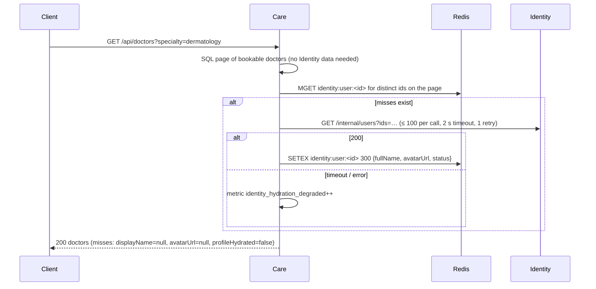

# Cross-Service Integration (Care → Identity)

Care is the **consumer** in all three platform integration cases. All calls go through `lib/identity-client`.
Implementation guidance: the **`cross-service-integration`** skill. The case definitions and failure policies are
platform-scope and authored in `../vcare-hub/architecture/landscape.md` (hub ADR 0008); this shard is Care's consumer
implementation of them (client, sync jobs, alerts) — when the two disagree, fix the hub first via `/system-design`.
Identity's contract (synced): `../vcare-hub/contracts/identity-service.openapi.yaml`.

| Local endpoint | Identity | Port |
|---|---|---|
| JWKS | `GET http://localhost:3000/.well-known/jwks.json` | public listener |
| Token, users, status | `http://localhost:3100/internal/*` | internal listener |

## User-token verification (no call per request)
Identity signs EdDSA access tokens (15 min). Care verifies them locally (`lib/auth`, built 2026-10-02) against the
JWKS cached in memory: re-fetched every 5 minutes (Identity's `max-age`), and on an unknown `kid` at most once per
minute; while refreshes fail the cached keys stay trusted for at most 1 hour after the last successful fetch, then
none are. It requires `iss=vcare-identity`, `aud` ∋ `vcare-care`, `typ=user`, `sub`/`exp`/`iat`/`jti`, and
well-formed `role`/`status`/`ev` (30 s clock tolerance). If the JWKS cannot be fetched and no cached key matches →
`401 Unauthorized`; an expired token → `401 TokenExpired`; verification is never skipped. The JWKS read is not one of
the integration cases and does not go through `lib/identity-client`; it forwards `X-Request-Id` like every call to
Identity. Readiness reports the cache as `checks.identityJwks` (informational).

## Service-token flow

```mermaid
sequenceDiagram
    participant IC as Care lib/identity-client
    participant ID as Identity :3100
    Note over IC: cache empty or now >= exp - 30s
    IC->>ID: POST /internal/auth/token<br/>grant_type=client_credentials, client_id, client_secret,<br/>scope="users:read users:status:write", audience=vcare-identity
    ID-->>IC: { access_token (typ=service, 300 s), token_type: Bearer, expires_in: 300 }
    Note over IC: cache; concurrent refreshes single-flighted
    IC->>ID: GET /internal/users?ids=… (Authorization: Bearer service token, X-Request-Id)
    alt 401
        ID-->>IC: 401
        IC->>ID: fetch a new token once, retry the call once
    end
```
The acting admin travels as data (`actorUserId`) for Identity's audit trail; it never grants authorization.
`SERVICE_CLIENT_SECRET` has no default and is never logged.

**Inbound:** `GET /internal/doctors/{userId}/summary` on Care's internal listener requires `typ=service`,
`aud` ∋ `vcare-care`, scope `doctors:read`. No MVP service client holds `doctors:read`; the endpoint serves admin
tooling and the Phase-2 AI service once a client is provisioned in Identity.

## Case 1 — Verification unlocks the account (retry, report pending)
Triggers: `PATCH /admin/applications/:id/approve` (→ `active`), `/reject` (→ `rejected`), `/reopen` and a doctor's
resubmission `rejected → submitted` (→ `pending`).

```mermaid
sequenceDiagram
    participant A as Admin
    participant C as Care
    participant DB as Care DB
    participant ID as Identity
    A->>C: PATCH /admin/applications/12/approve
    C->>DB: BEGIN; verification_status='approved', reviewed_by, review_note, decided_at,<br/>identity_sync_status='pending'; audit verification.approved; COMMIT
    loop up to 3 attempts, 2 s timeout, backoff 200 ms·2^n ±20%
        C->>ID: PATCH /internal/users/204/status {status: active, reason, actorUserId}
    end
    alt 200
        C->>DB: identity_sync_status='synced'
        C-->>A: 200 application
    else transient failures exhausted
        C->>DB: INSERT identity_sync_jobs (kind=verification, status=pending, next_attempt_at)
        C-->>A: 202 { identitySync: "pending" }
        Note over C: background retrier continues; alert IdentityApprovalSyncPending after 15 min
    else 409 InvalidStatusTransition (non-retryable)
        C->>DB: identity_sync_status='failed'; job status='failed'
        C-->>A: 202 { identitySync: "failed" }
        Note over C: alert IdentitySyncTransitionRejected; admin console shows it
    end
```
- The decision is **kept** in every branch; Identity owns the account state, Care owns the medical judgment.
- The doctor is **not bookable** until `verification_status='approved'` **and** `identity_sync_status='synced'`.
- Identity's status PATCH is idempotent, so blind retries are safe.

## Case 2 — Batch profile hydration (degrade, never fail)
Used by search, doctor profile, consultation lists, waiting room, calendar, the admin application queue.


- One call per page (chunked at 100 ids), never per row.
- Mapping: Identity `fullName` → Care `displayName`; `avatarUrl` unchanged; `status` is used **only** to hide
  non-active doctors from search when the cached data is fresh — never for authorization.
- A Case-2 outage never produces a 5xx; booking never waits on hydration.

## Case 3 — Suspension revokes sessions (must not degrade)

```mermaid
sequenceDiagram
    participant A as Admin
    participant C as Care
    participant DB as Care DB
    participant ID as Identity
    A->>C: PATCH /admin/doctors/204/suspend {reason}
    alt already suspended
        C-->>A: 200 no-op (current state)
    else not approved + synced
        C-->>A: 409 InvalidTransition
    end
    C->>DB: BEGIN; suspended_at, suspension_reason, identity_sync_status='pending';<br/>flag future booked/waiting consultations needs_admin_followup;<br/>audit doctor.suspended; COMMIT
    Note over C: from here no bookings and no doctor actions in Care
    loop inline attempts for ~6 s
        C->>ID: PATCH /internal/users/204/status {status: suspended, reason, actorUserId}
    end
    alt 200 (Identity revoked all refresh tokens in one transaction)
        C->>DB: identity_sync_status='synced'
        C-->>A: 200 SuspensionResult
    else transient failures
        C->>DB: INSERT identity_sync_jobs (kind=suspension) — retried forever, backoff ≤ 60 s
        C-->>A: 503 IdentityUnavailable, suspension: "applied-locally, session-revocation-pending"
        Note over C: alert IdentitySuspensionSyncFailing (page) after 3 consecutive failures
    else 409 InvalidStatusTransition
        C->>DB: identity_sync_status='failed'; stop retrying; keep local suspension
        C-->>A: 503 IdentityUnavailable (data.identitySyncStatus=failed)
        Note over C: page on-call immediately (IdentitySyncTransitionRejected)
    end
```
- **Never report a suspension as complete before Identity confirms.** The admin UI must show that sessions are not
  yet revoked while the response is 503.
- "Until it succeeds" covers transient failures only (network, timeout, 429, 5xx, one 401 token refresh).

## Case 4 — Reinstatement restores the account (retry, report pending)
[ADR 0012](../adr/0012-doctor-reinstatement.md), hub ADR 0009. **Provider change first:** Identity's internal status
route must accept `suspended → active` (today it refuses it).

```mermaid
sequenceDiagram
    participant A as Admin
    participant C as Care
    participant DB as Care DB
    participant ID as Identity
    A->>C: PATCH /admin/doctors/204/reinstate {reason}
    alt not suspended (already active and synced)
        C-->>A: 200 no-op
    else suspension not synced
        C-->>A: 409 InvalidTransition
    end
    C->>DB: BEGIN; suspended_at=NULL, suspension_reason=NULL, identity_sync_status='pending';<br/>audit doctor.reinstated; COMMIT (follow-up flags stay)
    Note over C: doctor still unbookable (sync pending)
    loop up to 3 attempts, 2 s timeout, backoff
        C->>ID: PATCH /internal/users/204/status {status: active, reason, actorUserId}
    end
    alt 200
        C->>DB: identity_sync_status='synced'; invalidate caches
        C-->>A: 200
    else transient failures exhausted
        C->>DB: INSERT identity_sync_jobs (kind=reinstatement)
        C-->>A: 202 { identitySync: "pending" }
        Note over C: alert IdentityReinstatementSyncPending after 15 min
    else 409 InvalidStatusTransition
        C->>DB: identity_sync_status='failed'
        C-->>A: 202 { identitySync: "failed" }
        Note over C: page (IdentitySyncTransitionRejected)
    end
```

## Notification contact lookup (degrade by delay)
Hub ADR 0010, [ADR 0011](../adr/0011-notification-outbox-and-reminders.md). **Provider change first.**
`care-worker` calls `GET /internal/users/contacts?ids=` (≤ 100 ids, scope `users:contact:read`, granted only to
care-service) once per outbox batch. The response (email, locale, fullName) lives in worker memory for that batch
only — never cached in Redis, never stored, never logged (the logger redacts `email`). Failure → the outbox rows
stay `pending` with backoff; users receive the email later. Unknown or non-active ids → `skipped`. The API
listener never calls this endpoint and its service token never requests the scope.

## Failure policy table
| | Case 1 | Case 2 | Case 3 |
|---|---|---|---|
| Endpoint | `PATCH /internal/users/:id/status` → `active`/`rejected`/`pending` | `GET /internal/users?ids=` | `PATCH /internal/users/:id/status` → `suspended` |
| Criticality | required for the doctor to work | cosmetic | security-critical |
| Policy (`x-failure-policy`) | `retry-report-pending` | `degrade` | `must-not-degrade` |
| Local effect first | decision + `pending` committed | none | suspension + flags committed |
| Per-attempt timeout | 2 s | 2 s | 2 s |
| Inline attempts | 3 | 2 (1 retry) | ~6 s |
| After inline failure | 202 `identitySync: pending`; durable job | cache or null fields; 200 | 503 `IdentityUnavailable`; durable job, no attempt cap |
| Non-retryable Identity 409 | `failed`, alert, 202 `identitySync: failed` | n/a | `failed`, page immediately, 503 |
| Alert | after 15 min unsynced | degraded ratio | after 3 consecutive failures (page) |
| Gate | bookable only when approved **and** synced | — | "complete" only when confirmed |

Rationale and rejected alternatives: [ADR 0004](../adr/0004-cross-service-failure-policies.md).

## Doctor account status — Care is the only initiator
The former known gap (a doctor status change made directly in Identity not reaching Care) is **closed** by hub
ADR 0006 (`../vcare-hub/adr/0006-doctor-account-status-via-care-only.md`, 2026-09-15): Identity's
`PATCH /api/users/:id/status` refuses doctor targets with `403 Forbidden`, so every doctor account-status change
is requested by Care through Cases 1 and 3, and `doctor_profiles.suspended_at` / `identity_sync_status` always move
with it. No Care contract change is required.

- Care still excludes non-active doctors from search using fresh Case 2 `status` as defence in depth.
- A `rejected` doctor can sign in and refresh at Identity (token `status=rejected`, identity-service ADR 0004), so
  the resubmission route (`rejected → submitted`, Identity `pending`) is reachable as designed.
- Reinstating a suspended doctor goes through Care as Case 4 (hub ADR 0009 amends ADR 0006); Identity's admin
  route still refuses doctor targets.

## Notifications
Booking confirmation, reminder, reschedule, cancellation, schedule-block, and "doctor joined" emails go through the
transactional outbox and `care-worker` ([ADR 0011](../adr/0011-notification-outbox-and-reminders.md)); they never
block or roll back the triggering write. Recipients are resolved through the contact lookup above.
