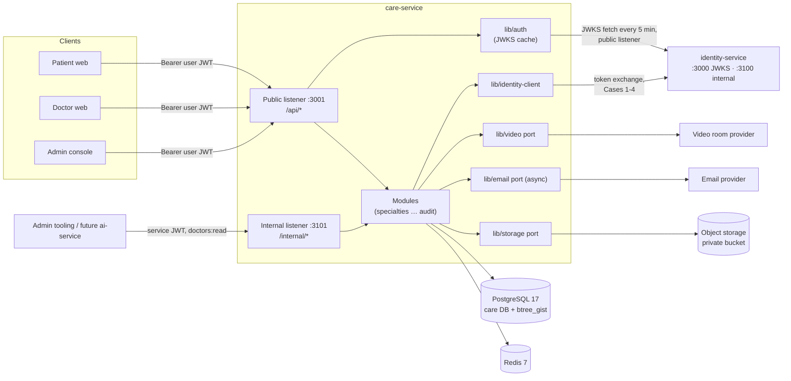

# Architecture Overview — care-service

Care is one deployable Node.js service with **two HTTP listeners**, its own PostgreSQL database, Redis, and
three outbound ports (identity-client, video, email) plus object storage. It is a modular monolith: one module
per bounded context, strict layering, no shared database with any other service. This is Care's own container
view; the platform C4 views, deployment topology, and capacity model live in the hub
(`../vcare-hub/architecture/overview.md`, `deployment.md`, `capacity.md`).

## Containers (C4 level 2)



| Container | Role |
|---|---|
| Public listener (`PORT=3001`) | `/api/*` — every user-facing route and `/api/health/live`, `/api/health/ready`. Behind the public ingress. |
| Internal listener (`INTERNAL_PORT=3101`) | `/internal/*` — `GET /internal/doctors/:userId/summary`, `/internal/health/live|ready`. Binds to the private interface; the ingress never routes `/internal`. |
| `care-worker` (separate component, same image) | Identity-sync retrier (built), upload-intent purge (built), audit partitions (built), notification outbox, reminder scan, `next-available` refresh ([ADR 0008](../adr/0008-care-worker-component.md), [deployment.md](./deployment.md)). |
| PostgreSQL | System of record for everything Care owns. `btree_gist` for the non-overlap exclusion constraint. `TIMESTAMPTZ`, UTC sessions. |
| Redis | Derived caches (`slots:*`, `next-available:*`, `identity:user:*`), idempotency records (24 h), rate-limit windows. Never a source of truth. |
| Object storage | Verification documents and record attachments under random keys; uploaded directly by browsers with presigned POSTs and turned into rows only after `complete` verifies the bytes; opened through on-demand, audited 60 s presigned GETs ([file-handling.md](./file-handling.md)). |
| auth (`lib/auth`) | User-token verification: Identity's JWKS cached in memory (`JwksCache`: 5-minute refresh, demand fetch on an unknown `kid` at most once per minute, keys trusted ≤ 1 h after the last success), `UserTokenVerifier` (jose `jwtVerify`), `userGuard()`. The JWKS fetch is a public-key read on Identity's public listener, not an integration case, so it does not go through identity-client. |
| identity-client (`lib/identity-client`, built for Cases 1 and 2; Cases 3, 4 and contacts planned) | The only code that calls identity-service's internal API: service-token cache, batch hydration (Case 2), status changes (Cases 1, 3, 4). |
| Video port (`lib/video`) | Creates rooms and issues short-lived per-participant join tokens from a third-party provider. |
| Email port (`lib/email`) | Sends notifications asynchronously; failure never affects the triggering write. |

## Module map

| Module | Owns | Key tables | Talks to |
|---|---|---|---|
| `specialties` | specialty catalog | `specialties` | — |
| `doctors` | **Built:** own-profile onboarding, languages and specialty links, accepting toggle, local suspension check. **Planned:** search and suspension writes | `doctor_profiles`, `doctor_specialties`, `doctor_languages` (built) | `SpecialtiesService` for linked specialty validation; identity-client (Case 2/3) and availability later |
| `verification` | documents, application states, decisions | `verification_documents`, `upload_intents`, `identity_sync_jobs` (**built**, 2026-10-08) | identity-client (Cases 1, 2), storage (uploads, download URLs) |
| `schedules` (built 2026-10-09) | working hours, exceptions, consultation types, conflict detection (behind the `ScheduleImpactProvider` port; no-op until `consultations`) | `working_hours`, `schedule_exceptions`, `consultation_types` | `consultations` (conflict lookup), `availability` (cache invalidation) |
| `availability` | slot computation and caches (no tables) | — (reads schedules + consultations) | `pkg/slots` |
| `consultations` | booking, reschedule, cancel, no-show, lists, calendar | `consultations` | `availability`, `doctors` (bookability), email, identity-client (Case 2) |
| `sessions` | waiting room, join/start/complete, room tokens | `consultations` (session columns) | video, email |
| `patients` | patient profile, clinical timeline | `patient_profiles` | `records`, `consultations` (relationship check) |
| `records` | medical records, amendments, attachments | `medical_records`, `medical_record_amendments`, `record_attachments` | storage (uploads, download URLs), `consultations` |
| `help-articles` | help center content | `help_articles` | — |
| `audit` | append-only audit log and its read API | `audit_logs` | — (called by every module through `lib/audit`) |
| `identity-client` (lib) | outbound Identity calls and their policies | — | identity-service |

Cross-module calls go through **services**, never another module's repository.

## Layering

```
src/app/<module>/   controller → service → repository     may import lib/, pkg/
src/lib/            built (foundation): config, di, error, logger, request-id, http (response, no-store,
                      pagination, cors, client-ip, route-pattern), validation, knex, redis, idempotency,
                      rate-limit, lifecycle, worker, async, types
                    built (access, 2026-10-02): auth (JWKS cache, verifier, userGuard), rbac (authorize,
                      boot route assertion, markers), audit (AuditRecorder, audit-partitions loop),
                      knex/app-login, redis/breaker
                    built (specialties, 2026-10-04): auth/require-auth, knex/pg-errors (23505 → constraint),
                      http/pagination text + µs timestamp cursors, validation/transforms (ToInt, ToBoolean),
                      validation/string-decorators (CodePointLength, NoControlCharacters)
                    built (verification, 2026-10-08): identity-client (service token, setUserStatus, getUsersBatch),
                      storage (S3 port + adapter), knex/session-advisory-lock, http/pagination signed-cursor
                    planned: video, email
                    may import pkg/; never app/<module>
src/pkg/            pure functions: utils/time.ts, utils/canonical-json.ts, utils/uuid.ts, utils/id.ts (built);
                      slots/, utils/interval.ts (planned) — no env, no I/O, no clock (now is passed in)
```

- Controllers validate DTOs and call one service method; no business logic.
- Services own transactions, domain rules, audit calls, and the choice of identity-client policy.
- Repositories are exported functions with explicit column lists over Knex (see [ADR 0001](../adr/0001-no-orm-knex-raw-sql.md)).
- `pkg/slots` holds the whole availability algorithm so the slot endpoint and booking re-validation share one implementation. Built so far: the open-interval resolution (`resolveOpenIntervals`, DST, `24:00`), shipped by `schedules`; busy subtraction and slicing arrive with `availability` ([scheduling-slots.md](./scheduling-slots.md)).

## Request pipeline (public listener)

```mermaid
sequenceDiagram
    participant C as Client
    participant RID as request-id
    participant H as helmet + CORS
    participant RL as rate-limit
    participant UG as user-guard
    participant AZ as authorize(policy)
    participant IDEM as idempotency
    participant CT as controller
    participant SV as service
    participant EH as errorHandler
    C->>RID: HTTP request (+X-Request-Id?)
    RID->>H: req.requestId set
    H->>RL: security headers
    RL->>UG: Redis sliding window
    UG->>AZ: verify JWT via cached JWKS, req.auth
    AZ->>IDEM: role, account state, email, checks, ownership (DB)
    IDEM->>CT: required on booking writes; replay or continue
    CT->>SV: validated DTO
    SV-->>CT: result (transaction + audit committed)
    CT-->>C: {success:true,data,meta} + X-Request-Id
    Note over EH: any thrown AppError / unknown error → one ErrorEnvelope
```

1. **request-id** — adopt a valid UUID `X-Request-Id` (lower-cased) or generate one; echo it; open the
   `AsyncLocalStorage` request context, so every log line written anywhere downstream (services, repositories,
   promise continuations) carries `requestId` without passing a logger around.
2. **helmet** (+ CORS allowlist in local development only — production is a single origin, hub ADR 0005); `Cache-Control: no-store` on clinical and consultation routes.
3. **rate-limit** — search/slots 60/min per IP and 120/min per user; booking writes 10/min per user; uploads 20/h per user.
4. **user-guard** — verifies the EdDSA token locally against Identity's JWKS; no network call per request.
5. **authorize(policy)** — deny by default, in this order: role → token status (onboarding: `pending|active|rejected`; everything else: `active`; `suspended` never) → `emailVerified` (booking) → policy checks (practising doctors: not locally suspended) → ownership resolved from the database ([rbac.md](./rbac.md) → Principles).
6. **idempotency** — required on book, reschedule, cancel.
7. **controller → service** — the service re-checks invariants inside its transaction and writes audit rows.
8. **errorHandler** — the single producer of the error envelope.

The internal listener runs request-id → service-guard (service token, `aud` contains `vcare-care`, scope) →
authorize → controller. It makes no outbound calls on its request path.

**As built by the foundation (2026-09-28).** Both listeners start with request-id → in-flight counter (graceful
drain) → request logger → `helmet()`; the public listener adds the dev-only CORS allowlist; then any `OPTIONS` not
answered as an allowed preflight → `404 NotFound`; `express.json` (100 kB); the health router and the module routers;
`notFound`; `errorHandler`. Rate-limit, guard, `authorize`, and idempotency are mounted **per router** by each module
(step order above), not globally. At the foundation only the health routes existed
([infrastructure.md](./infrastructure.md) → HTTP hardening, Health).

**As built by `access` (2026-10-02).** After mounting health and the module routers, both apps call
`assertRoutesAuthorized(app.router)`: a route without `authorize`, or without a guard before it, stops the process at
boot (health is exempt by marker; test-only routers are mounted after the check). `server.ts` starts the JWKS cache
(one background fetch + the 5-minute interval) and stops it first on shutdown. `care-worker` has its own Postgres pool
(`care-worker`, 4 connections, as `care_app`) and runs the `audit-partitions`, `identity-sync` and `upload-intent-purge` loops. `care-api` and `care-worker` log in
as `care_app` (member of `vcare_app`); only `care-migrate` holds the owner credential
([ADR 0018](../adr/0018-db-role-split-explicit-grants-partition-function.md)).

**As built by `specialties` (2026-10-04).** The first business router: `src/routes.ts` mounts
`buildSpecialtiesRouter()` on the public listener with the full step order — `GET /api/specialties` runs
rate-limit (per IP) → user-guard → authorize → rate-limit (per user) → controller; `POST` adds optional idempotency;
`PATCH /api/specialties/:id` is guard → authorize → controller. No call to Identity, storage, or the worker
([specialties spec](../specialties/spec.md)).
